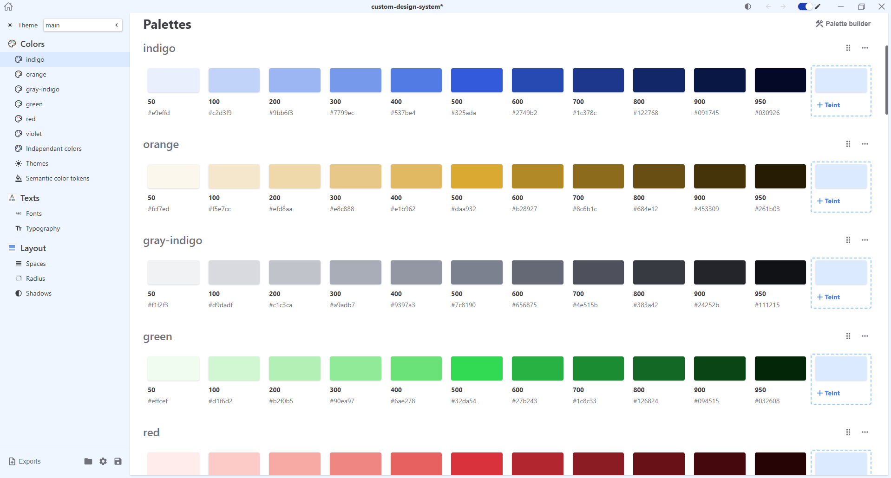
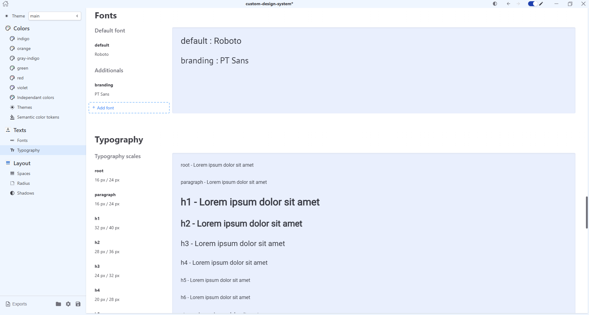
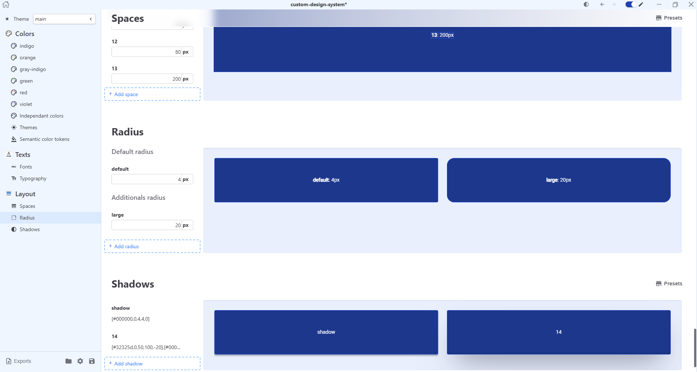

# UITEA

__Build your customs design systems and export to other platforms.__

 

## Features
- Build color palettes & craft semantic tokens :white_check_mark:
- Generate alternate color themes :white_check_mark:
- Typographies rules :white_check_mark:
- Layout (spaces, radius, shadows) :white_check_mark:
- Exports Figma & CSS :white_check_mark:

## Build your design system

## Roadmap
- Next release : palette builder & theme generator improvement
- Icons & transitions
- UI Kit & components definition

## Contributing
If you would like to contribute, please see [CONTRIBUTING](./CONTRIBUTING.md)

